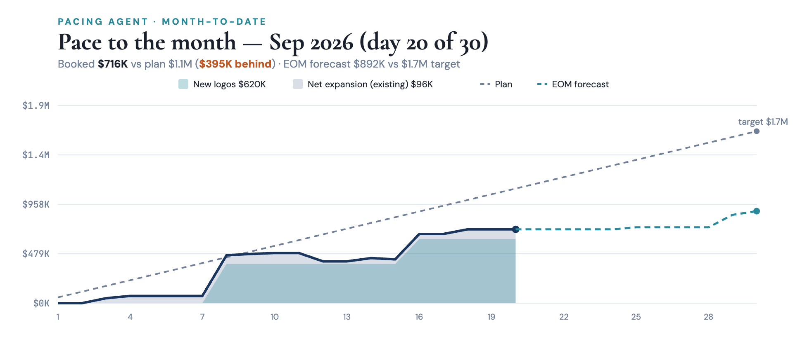
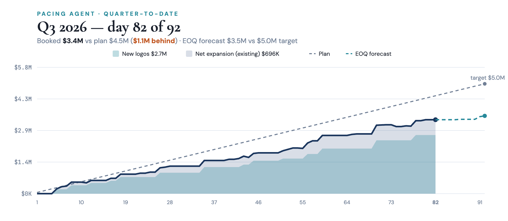
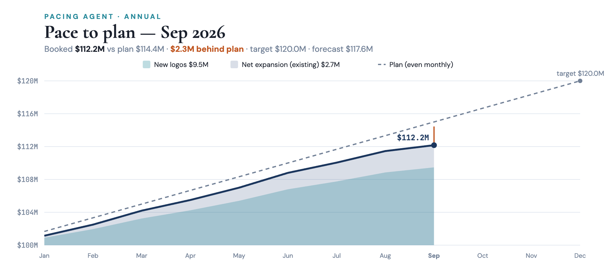
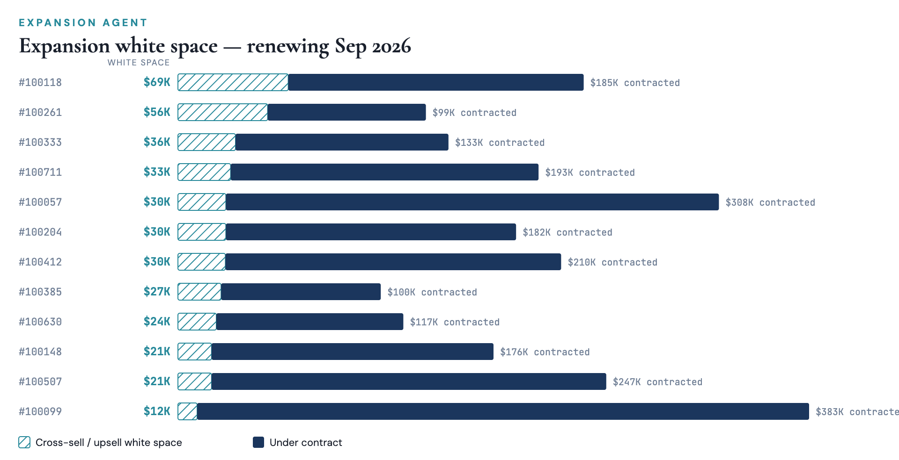

# Pacing Agent demo video — script

Transcript generated from the video's own script data (`reel.html` → `BEATS`). Every number comes from the
illustrative dataset as of 2026-09-20; charts are the live tools' renderers. Do not edit by hand — rebuild with
`~/.venvs/pacer/bin/python demo-site/build_pacing_video.py` in pacerai-platform-claude-native.

## User types: `pace`

*Tool call: `pace` (Pacer AI)*

*Tool call: `pace_quarterly` (Pacer AI)*

*Tool call: `pace_annual` (Pacer AI)*

As of September 20, 2026, you are **behind plan on all three horizons**, and the cause is the same each time: expansion from existing customers is running well under plan.

### Pacing summary

| Horizon | Booked | Plan to date | Variance | Forecast landing | Target | Forecast shortfall |
|---|---|---|---|---|---|---|
| Month (day 20 of 30) | $716K | $1.11M | −$395K | $892K | $1.67M | −$775K |
| Q3 (day 82 of 92) | $3.37M | $4.46M | −$1.09M | $3.54M | $5M | −$1.46M |
| Year (ARR) | $112.2M | $114.4M | −$2.28M | $117.6M | $120M | −$2.44M |

*How to read this:* “Plan to date” is the annual plan spread evenly across the year and prorated to today. The FY2026 plan takes ARR from $100M to $120M: +$20M of Net New ARR ($14M new logo, $6M expansion), or $1.67M a month. “Forecast landing” is booked ARR plus weighted open pipeline.

### The month: September

Two new logos closed for $620K. Renewals added a net $96K: 12 accounts came due, 8 expanded, 2 renewed flat, 1 downsold and 1 churned ($80K, account 100127).

| Account | Renewed | Prior ARR | Renewed at | Change |
|---|---|---|---|---|
| 100031 | 09/03 | $131K | $179K | +$48K |
| 100174 | 09/04 | $122K | $144K | +$22K |
| 100246 | 09/08 | $87K | $102K | +$15K |
| 100088 | 09/09 | $134K | $146K | +$12K |
| 100302 | 09/10 | $196K | $205K | +$9K |
| 100455 | 09/11 | $50K | $50K | flat |
| 100127 | 09/12 | $80K | − | churned |
| 100540 | 09/14 | $90K | $121K | +$31K |
| 100219 | 09/15 | $43K | $31K | −$12K |
| 100391 | 09/16 | $66K | $72K | +$6K |
| 100668 | 09/17 | $104K | $104K | flat |
| 100063 | 09/18 | $141K | $186K | +$45K |

| New logo | Closed | ARR |
|---|---|---|
| Crestline Partners (100814) | 09/08 | $380K |
| Pinnacle Consulting (100815) | 09/16 | $240K |

### The quarter: Q3

Q3 has 10 days left. Weighted pipeline closing before quarter-end adds only $176K, which leaves $1.46M of the $5M target uncovered. There is no realistic path to the full quarter; the useful goal is to land the expansion at the accounts renewing this month and carry the rest into Q4.

### The year: the Go-Get

The **Go-Get** is the forecast gap: the target minus booked ARR minus weighted open pipeline. It is **$2.44M**, the number that actually needs closing. It is smaller than the $7.83M gap to target because that figure ignores pipeline already in flight.

Year to date, new logos have added $9.47M of Net New ARR against $10.1M planned (94%). Existing customers have added $2.70M against $4.33M (62%). Expansion is the larger lever for closing the gap.

Want details to help you close the gap? Just type **gap**.

[Create a spreadsheet] *(button, visual only)*

## User types: `gap`

September needs **$775K** more to reach its $1.67M target: the target minus booked ARR minus weighted open pipeline. 10 days are left, so the fastest lever is the accounts renewing before month-end.

*Tool call: `whitespace_list` (Pacer AI)*

### Motion 1: expansion at accounts renewing by Sep 30

“White space” is how much more an account could buy if it owned every product at the same seat count as its main subscription. Twelve accounts renewing in the next 10 days carry $389K of it:

| Account | Renews | White space | Under contract | % of contract |
|---|---|---|---|---|
| 100118 | 09/22 | $69K | $185K | 37% |
| 100261 * | 09/28 | $56K | $99K | 57% |
| 100333 | 09/24 | $36K | $133K | 27% |
| 100711 | 09/30 | $33K | $193K | 17% |
| 100057 | 09/24 | $30K | $308K | 10% |
| 100204 | 09/23 | $30K | $182K | 17% |
| 100412 | 09/25 | $30K | $210K | 14% |
| 100385 | 09/30 | $27K | $100K | 27% |
| 100630 | 09/29 | $24K | $117K | 21% |
| 100148 | 09/29 | $21K | $176K | 12% |
| 100507 | 09/28 | $21K | $247K | 9% |
| 100099 | 09/25 | $12K | $383K | 3% |
| Total |  | $389K | $2.33M | 17% |

The higher the last column, the more of the account is left to sell. 100118, 100333 and 100385 have the most room relative to what they pay today. * 100261 has more, but uses none of the products it already owns: secure that renewal before pitching more.

*Tool call: `new_logos` (Pacer AI)*

### Motion 2: new logos

Eight people who championed a purchase at one of your customers now work at a look-alike prospect. Those warm accounts carry $917K of indicative annual contract value (ACV: the average ARR of your customers in the same market):

| Prospect | Indicative ACV | Warm contact |
|---|---|---|
| Silverlake Software | $152K | Casey Ivanov, Head of RevOps (ex-Riverstone) |
| Lakeside Technologies | $152K | Cameron Flores, VP Revenue (ex-Foxglove) |
| Harborview Industries | $152K | Jordan Okafor, VP Revenue (ex-Norwood) |
| Brightpath Analytics | $115K | Avery Cohen, VP Finance (ex-Hollowell) |
| Quarry Labs | $87K | Parker Lindqvist, Head of RevOps (ex-Maplewood) |
| Ironclad Robotics | $87K | Casey Martin, Director of Finance (ex-Valemont) |
| Ironclad Data | $87K | Reese Lindqvist, Controller (ex-Copperfield) |
| Larkspur Analytics | $87K | Finley Lindqvist, VP Revenue (ex-Eastgate) |

Orchard Robotics and Maplewood Holdings ($152K and $152K) are cold. New-logo cycles rarely close in 10 days, so these carry the gap into Q4 and the $2.44M Go-Get.

### Where this leaves September’s $775K

| Source | Gross potential | Share of $775K | Timing |
|---|---|---|---|
| Expansion: 12 accounts renewing by Sep 30 | $389K | 50% | September |
| New logos: 8 warm prospects | $917K | 118% | Q4 |
| New logos: 2 cold prospects | $303K | 39% | Q4 and later |

These are gross figures with no win rate applied. Even if every renewing account bought its full white space, September would land at $1.28M, $386K short. Start the expansion conversations at 100118, 100333 and 100385 this week, and open the 8 warm prospects now so they land in Q4.

I can add these lists as tabs in a workbook, or break the expansion list down by product so each rep knows what to pitch.

## End card

**Type “pace” in your own Claude** — Connect the Pacer AI demo in two minutes. No credit card, no call required.
[Try the Demo Free →](https://getpacerai.com/demo-connect) · Review the output · Replay

*Review the output* closes the card and scrolls back to the top so the viewer can read the whole conversation;
a bar keeps *Try the Demo Free* and *Replay* in reach.
